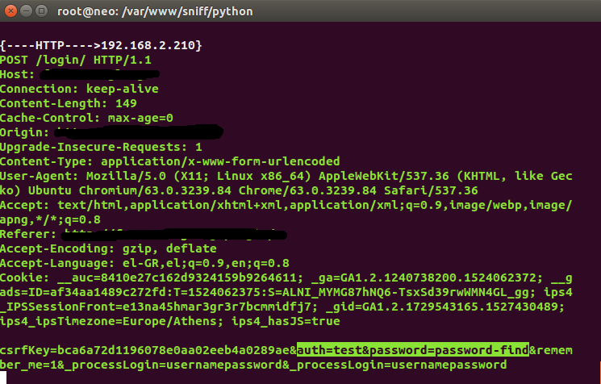
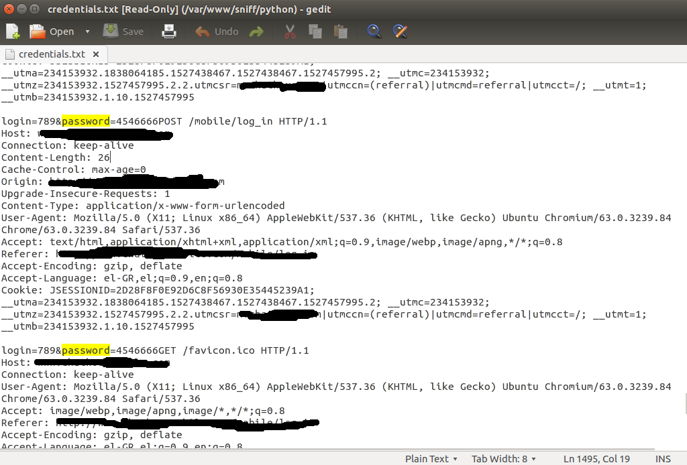

 Http-sniff is a programm for sniff all trafic in a lan ow wlan network   
 
 Instructions for installing libraries   
 
 cd /temp  
 
 git clone https://github.com/secdev/scapy  
 
 cd /scapy  
 
 sudo python setup.py install or python setup.py  

 wget https://raw.githubusercontent.com/secdev/scapy/v1.2.0.2/scapy.py   

 sudo python scapy.py    
 

       

